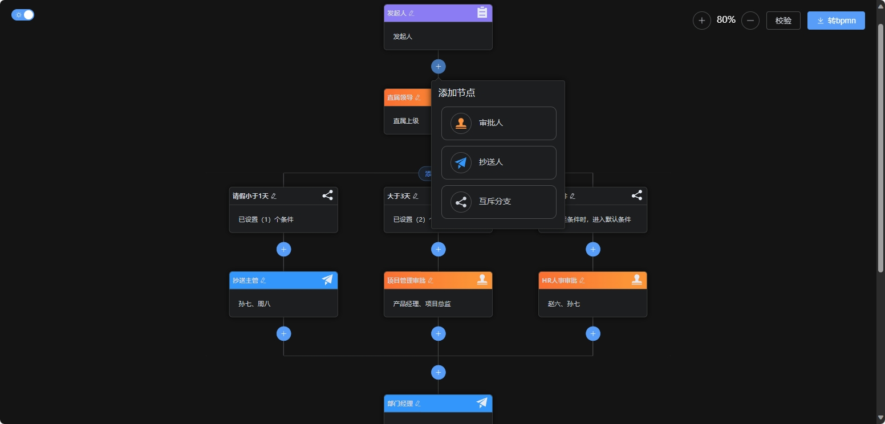
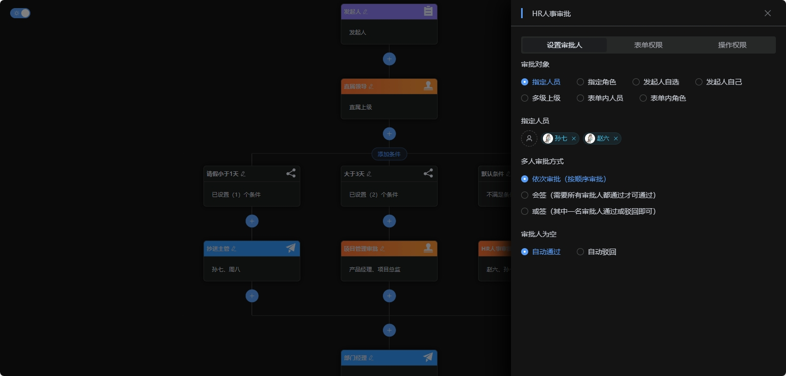

    <h1>lowflow-design</h1>
    
低代码流程设计器

## 介绍

lowflow-design是一个基于`Vue3`，`Vite`，`TypeScript`，`Element-Plus`等技术栈开发的，适用于低代码或无代码开发平台的流程设计器。
让普通人也能通过简单配置快速搭建流程。  
并提供了将json转xml的后端代码：[lowflow-design-converter](https://gitee.com/cai_xiao_feng/lowflow-design-converter)。

## 在线预览

https://tsai996.github.io/lowflow-design/

#### 成品案例

https://demo.lowflow.vip/

#### 项目源码

|        | 后端源码                                                     | 前端源码                                           |
|--------|----------------------------------------------------------|------------------------------------------------|
| github | https://github.com/tsai996/lowflow-design-converter      | https://github.com/tsai996/lowflow-design      |
| 码云     | https://gitee.com/cai_xiao_feng/lowflow-design-converter | https://gitee.com/cai_xiao_feng/lowflow-design |

#### 示例图

    
    

## 特性

| 节点   | 状态 | 描述                                  |
|------|----|-------------------------------------|
| 审批人  | ✅  | 支持单人、多人、角色、部门、发起人、上级领导、自定义审批人、等等... |
| 抄送人  | ✅  | 支持单人、多人、角色、部门、发起人、上级领导、自定义抄送人、等等... |
| 互斥分支 | ✅  | 支持或/且条件组，条件组组合                      |
| 计时等待 | ✅  | 支持秒、分、时、天、周、月、自定义时间等待               |
| 消息通知 | ✅  | 站内、邮件、企业微信、钉钉、飞书、短信、自定义通知内容         |

## 目录结构
~~~
├── public
├── src
│   ├── api                                     # 接口
│   │   ├── index.ts                            # 接口统一管理
│   │   ├── modules                             # 接口模块
│   │   │   ├── role.ts                         # 角色接口
│   │   │   ├── user.ts                         # 用户接口
│   │   │   └── model.ts                        # 流程模型接口
│   ├── assets                                  # 静态资源
│   │   ├── logo.png
│   │   └── ...
│   ├── components                              # 公共组件
│   │   ├── AdvancedFilter                      # 高级条件筛选
│   │   ├── Render                              # 组件渲染器
│   │   ├── RoleSelector                        # 角色选择器
│   │   ├── SvgIcon                             # svg图标
│   │   ├── UserSelector                        # 用户选择器
│   │   └── ...
│   ├── mock                                    # mock模拟数据
│   │   ├── index.ts
│   │   ├── role.ts                             # 角色接口
│   │   ├── user.ts                             # 用户接口
│   │   └── ...
│   ├── router                                  # 路由
│   │   ├── index.ts
│   │   └── ...
│   ├── stores                                  # 状态管理
│   │   ├── index.ts
│   │   └── ...
│   ├── styles                                  # 全局样式
│   │   ├── index.scss
│   │   └── ...
│   ├── typings                                 # 全局类型
│   │   ├── index.scss
│   │   └── ...
│   ├── views     
│   │   ├── flowDesign                          # 流程设计器     
│   │   │   ├── nodes                           # 流程节点  
│   │   │   │   ├── Add.vue                     # 添加节点
│   │   │   │   ├── ApprovalNode.vue            # 审批人节点
│   │   │   │   ├── CcNode.vue                  # 抄送人节点
│   │   │   │   ├── ConditionNode.vue           # 条件节点
│   │   │   │   ├── EndNode.vue                 # 结束节点
│   │   │   │   ├── ExclusiveNode.vue           # 互斥分支节点
│   │   │   │   ├── GatewayNode.vue             # 网关节点
│   │   │   │   ├── Node.vue                    # 节点
│   │   │   │   ├── StartNode.vue               # 开始节点
│   │   │   │   ├── NotifyNode.vue              # 消息通知节点
│   │   │   │   ├── TimerNode.vue               # 计时等待节点
│   │   │   │   ├── TreeNode.vue                # 节点树
│   │   │   │   └── type.ts                     # 节点类型
│   │   │   ├── panels                          # 属性面板  
│   │   │   │   ├── ApprovalPanel.vue           # 审批人配置面板
│   │   │   │   ├── CcPanel.vue                 # 抄送人配置面板
│   │   │   │   ├── ConditionPanel.vue          # 条件配置面板
│   │   │   │   ├── index.vue                   # 属性面板抽屉
│   │   │   │   ├── StartPanel.vue              # 开始配置面板
│   │   │   │   ├── NotifyPanel.vue             # 消息通知配置面板
│   │   │   │   └── TimerPanel.vue              # 计时等待配置面板
│   │   ├── home                                # 首页
│   │   └── ...
│   ├── App.vue
│   ├── main.ts
│   └── shims-vue.d.ts
├── .gitignore
├── package.json
├── README.md
├── unocss.config.ts
└── vite.config.ts
~~~

## 添加微信好友拉入群聊（备注：加群）

    
    

**求一份内推岗位**
## 赞助

开源不易如果该项目对您有帮助，您可以请我喝杯奶茶。

    
    

## 推荐

大家在使用本项目时，推荐结合贺波老师的书
[《深入Flowable流程引擎：核心原理与高阶实战》](https://item.jd.com/14804836.html)学习。这本书得到了Flowable创始人Tijs Rademakers亲笔作序推荐，对系统学习和深入掌握Flowable的用法非常有帮助。

