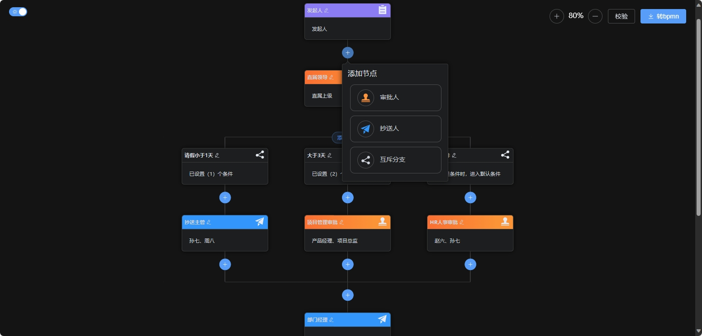
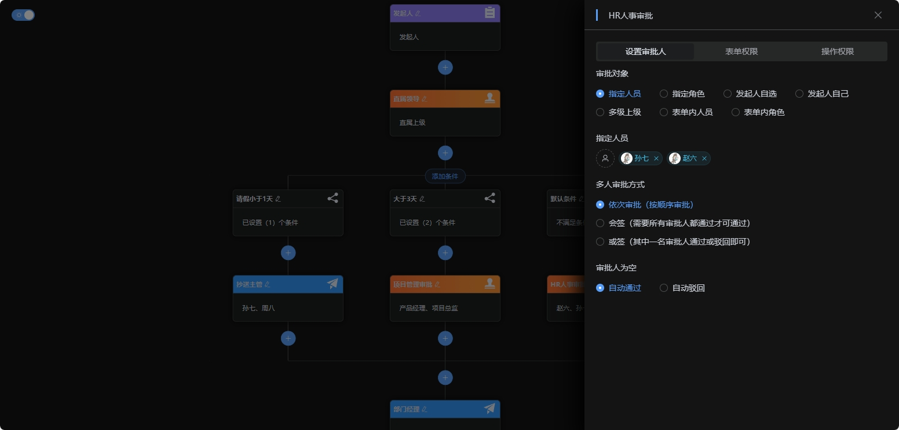
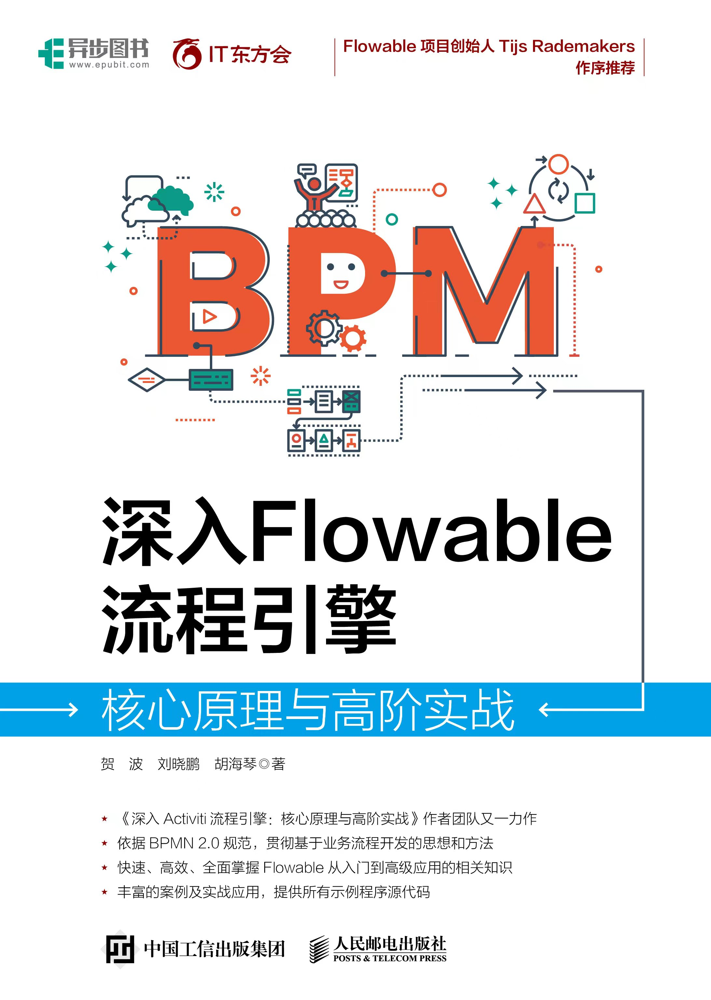

<div align="center">
  <h1>lowflow-design</h1>
  <p>低代码流程设计器</p>
  <p>
    <a href="./README.md">中文</a> | <a href="./README.en.md">English</a>
  </p>
</div>

## 项目简介
`lowflow-design` 是一个基于 `Vue 3`、`Vite`、`TypeScript`、`Element Plus` 的流程设计器，适用于低代码/无代码平台中的流程配置场景。

项目支持通过可视化方式快速搭建流程，并可配合后端转换项目将流程 JSON 转换为 BPMN XML：
- 后端转换器：[GitHub](https://github.com/tsai996/lowflow-design-converter) | [Gitee](https://gitee.com/cai_xiao_feng/lowflow-design-converter)
- 传统 `bpmn-js` 流程设计器：[GitHub](https://github.com/tsai996/vue-bpmn-designer) | [Gitee](https://gitee.com/cai_xiao_feng/vue-bpmn-designer)

## 在线体验
- 预览地址：<https://tsai996.github.io/lowflow-design/>
- 成品示例：<https://demo.lowflow.vip/>

## 效果预览
<p>
  
  
</p>

## 功能特性
- 审批节点：支持单人、多人、角色、部门、发起人、上级领导、自定义审批人等。
- 抄送节点：支持单人、多人、角色、部门、发起人、上级领导、自定义抄送人等。
- 条件分支：支持条件组及组合逻辑。
- 计时等待：支持秒、分、时、天、周、月及自定义时长。
- 消息通知：支持站内信、邮件、企业微信、钉钉、飞书、短信等通知方式。

## 技术栈
- Vue 3
- TypeScript
- Vite
- Element Plus
- Pinia
- Vue Router
- UnoCSS

## 快速开始
### 1. 安装依赖
```bash
npm install
```

### 2. 启动开发环境
```bash
npm run dev
```

### 3. 构建
```bash
npm run build
```

### 4. 预览构建产物
```bash
npm run preview
```

## 常用脚本
```bash
npm run dev         # 本地开发
npm run build       # 生产构建（含类型检查）
npm run build:dev   # development 模式构建
npm run build:test  # test 模式构建
npm run preview     # 预览构建产物
npm run type-check  # 类型检查
npm run lint        # ESLint（自动修复）
npm run format      # Prettier 格式化（src）
```

## 项目结构
```text
.
|-- public/
|-- src/
|   |-- api/
|   |-- assets/
|   |-- components/
|   |-- hooks/
|   |-- mock/
|   |-- router/
|   |-- stores/
|   |-- styles/
|   |-- typings/
|   |-- views/
|   |   |-- flowDesign/
|   |   |   |-- nodes/
|   |   |   |-- panels/
|   |   |   `-- index.vue
|   |-- App.vue
|   `-- main.ts
|-- package.json
|-- vite.config.ts
`-- README.md
```

## 源码仓库
| 平台 | 前端 | 后端转换器 |
| --- | --- | --- |
| GitHub | <https://github.com/tsai996/lowflow-design> | <https://github.com/tsai996/lowflow-design-converter> |
| Gitee | <https://gitee.com/cai_xiao_feng/lowflow-design> | <https://gitee.com/cai_xiao_feng/lowflow-design-converter> |

## 交流与支持
### 交流群
<p>
  
  
</p>

### 赞助
如果这个项目对你有帮助，欢迎赞助支持。

<p>
  
  
</p>

## 推荐阅读
推荐搭配阅读《深入 Flowable 流程引擎：核心原理与高阶实战》：
<https://item.jd.com/14804836.html>


